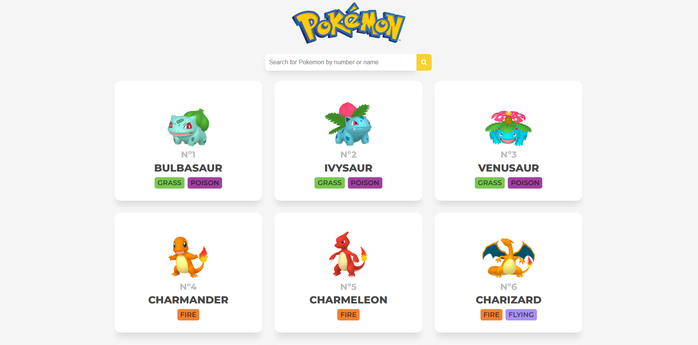
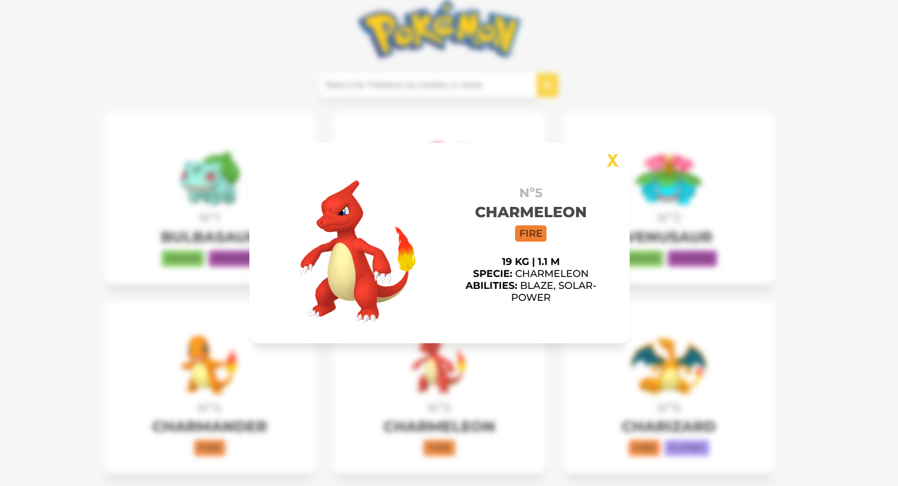

# Pokédex 🏆

Una Pokédex interactiva desarrollada con HTML, CSS, JavaScript y testeada con Cypress, que permite buscar y visualizar información sobre diferentes Pokémon.

## Sitio web
([Pokedex](https://pokedex-zeta-khaki-84.vercel.app/))

## 🚀 Características
- 🔎 **Búsqueda de Pokémon** por nombre o número.
- 📜 **Visualización de detalles** como tipo, habilidades y estadísticas.
- 🎨 **Interfaz amigable y responsiva**.
- ⚡ **Consumo de la API de Pokémon** ([PokeAPI](https://pokeapi.co/)).

## 🛠️ Tecnologías Utilizadas
- **JavaScript**
- **HTML & CSS**
- **Fetch API** para obtener datos desde PokeAPI.

📷 Capturas de Pantalla

